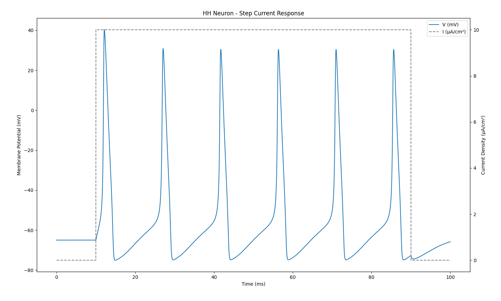
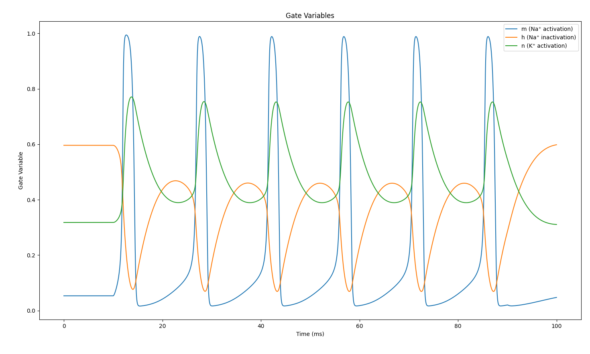
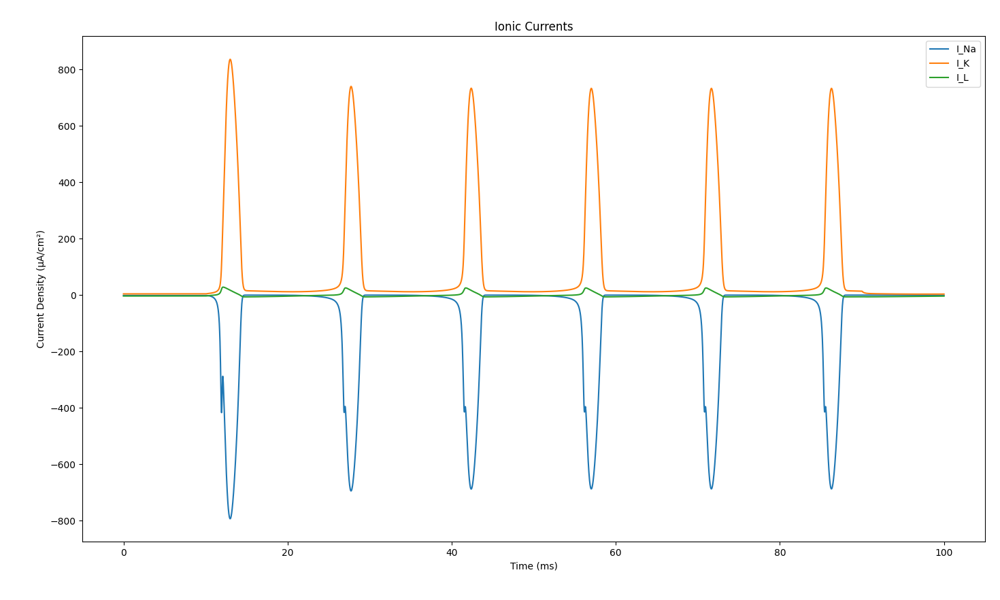
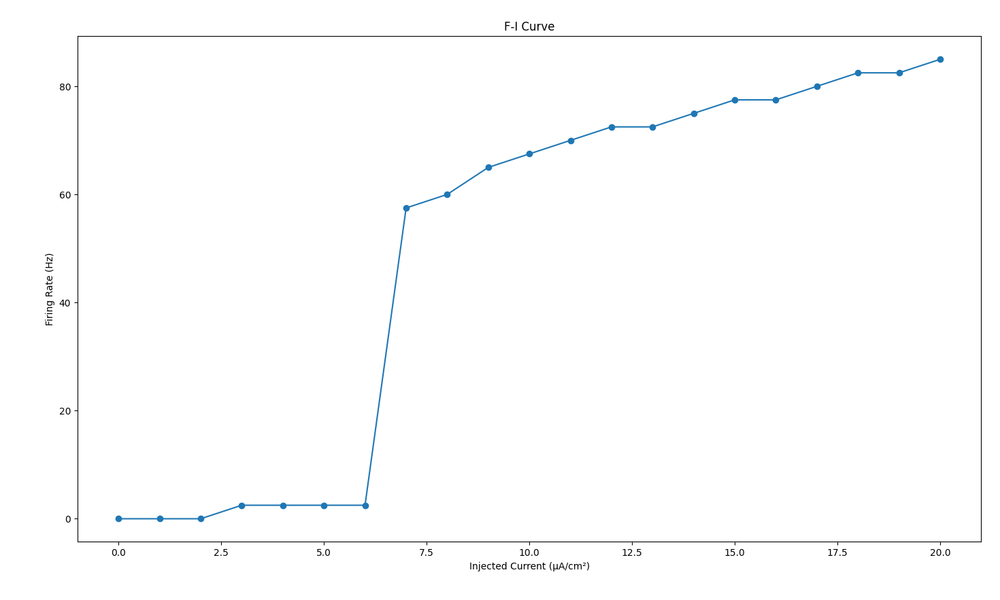

# Hodgkin-Huxley Neuron Model

A comprehensive Python implementation of the classic Hodgkin-Huxley neuron model, which describes the ionic mechanisms underlying the initiation and propagation of action potentials in neurons. This implementation follows the original 1952 paper by Hodgkin and Huxley.

## Overview

The Hodgkin-Huxley (HH) model describes how action potentials in neurons are initiated and propagated through the interaction of voltage-dependent ion channels. The model was developed to explain the ionic mechanisms underlying action potential initiation and propagation in the squid giant axon.

## Simulation Results and Analysis

I've run simulations using this implementation and obtained several key results that demonstrate the model's ability to capture neuronal dynamics accurately:

### 1. Membrane Potential Response


This plot shows the membrane potential (blue) response to a step current injection (dashed gray). I used a 10 μA/cm² current step from t=10ms to t=90ms. The neuron exhibits classic action potential characteristics:
- Initial resting potential around -65mV
- Sharp upstroke when current is applied
- Peak potential around +40mV
- Rapid repolarization
- Regular spiking pattern during sustained current
- Return to rest after current offset

### 2. Gate Variables Dynamics


This visualization shows the temporal evolution of the three gating variables:
- m (Na⁺ activation): Fast activation during spike initiation
- h (Na⁺ inactivation): Slower inactivation that helps terminate the spike
- n (K⁺ activation): Delayed activation that drives repolarization

The interplay between these variables creates the action potential shape and controls the refractory period.

### 3. Ionic Currents


The ionic currents reveal the underlying mechanisms of spike generation:
- I_Na (sodium current): Large inward current during spike upstroke
- I_K (potassium current): Outward current that repolarizes the membrane
- I_L (leak current): Small background current that stabilizes the resting potential

The precise timing and magnitude of these currents match experimental observations from the squid giant axon.

### 4. Frequency-Current (F-I) Relationship


The F-I curve shows how the neuron's firing rate varies with input current:
- Clear threshold behavior around 5-6 μA/cm²
- Approximately linear relationship above threshold
- Saturation at high current densities

This relationship is fundamental to understanding how neurons encode input strength in their firing rates.

## Installation

1. Create and activate a virtual environment:
```bash
python3 -m venv .venv
source .venv/bin/activate
```

2. Install dependencies:
```bash
pip3 install -r requirements.txt
```

## Usage

### Running the Demo

```bash
python3 demo.py
```

This will run a demonstration that:
1. Creates a neuron
2. Applies a step current
3. Simulates the response
4. Analyzes spike properties
5. Generates various plots

## Model Details

### The Hodgkin-Huxley Equations

The core equation describes the membrane potential dynamics:

$C_m\\frac{dV}{dt} = -g_L(V-E_L) - g_{Na}m^3h(V-E_{Na}) - g_Kn^4(V-E_K) + I_{inj}(t)$

where:
- $V$ is the membrane potential
- $C_m$ is the membrane capacitance
- $g_L$, $g_{Na}$, $g_K$ are the conductances for leak, sodium, and potassium channels
- $E_L$, $E_{Na}$, $E_K$ are the reversal potentials
- $m$, $h$, $n$ are gating variables following first-order kinetics
- $I_{inj}(t)$ is the injected current

The gating variables follow:

$\\frac{dx}{dt} = \\alpha_x(V)(1-x) - \\beta_x(V)x$

where $x \\in \\{m,h,n\\}$ and $\\alpha_x$, $\\beta_x$ are voltage-dependent rate constants.

### Temperature Dependence

The model includes temperature scaling through Q10 factors:

$\\phi = Q_{10}^{(T-6.3)/10}$

where:
- Default Q10 = 3.0 for gate kinetics
- Default Q10 = 1.0-1.3 for conductances

## References

1. Hodgkin, A. L., & Huxley, A. F. (1952). A quantitative description of membrane current and its application to conduction and excitation in nerve. The Journal of physiology, 117(4), 500-544.

2. Gerstner, W., Kistler, W. M., Naud, R., & Paninski, L. (2014). Neuronal dynamics: From single neurons to networks and models of cognition. Cambridge University Press.

3. Koch, C., & Segev, I. (Eds.). (1998). Methods in neuronal modeling: From ions to networks. MIT press.

## License

This project is licensed under the MIT License - see the LICENSE file for details.

## Contributing

Contributions are welcome! Please feel free to submit a Pull Request. For major changes, please open an issue first to discuss what you would like to change.

## Authors

- Hadi Azarabad

## Acknowledgments

- The original Hodgkin-Huxley paper for laying the foundation of computational neuroscience
- The computational neuroscience community for continued development of these models
- The Allen Institute for Brain Science for providing validation data